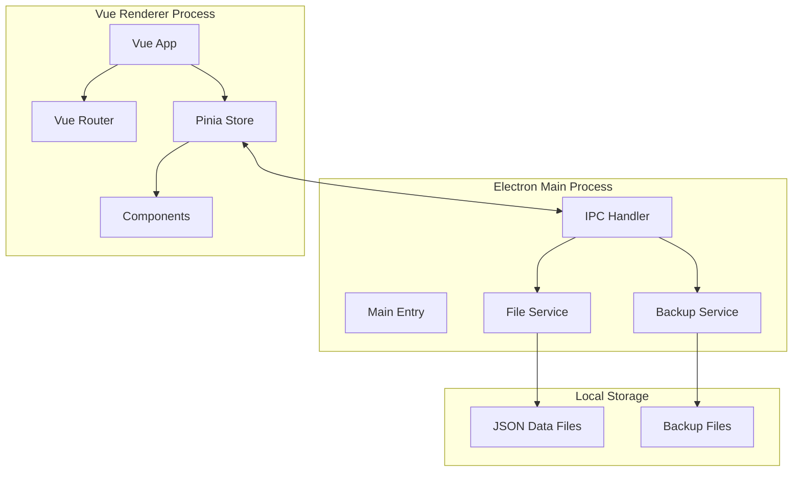
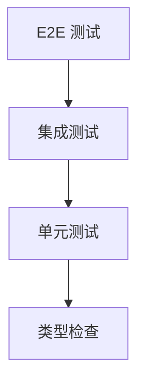

# Local Ledger - 技术设计文档

Feature Name: local-ledger
Updated: 2026-02-28

## Description

本地账本软件是一款基于 Electron + Vue.js 的桌面应用，用于个人财务管理。软件采用 JSON 文件存储数据，支持账目录入、分类管理、账户管理、数据统计和导入导出功能。

## Architecture

### 系统架构图



### 技术栈总览

| 层级 | 技术选型 | 版本 | 说明 |
|------|----------|------|------|
| 桌面框架 | Electron | ^28.x | 跨平台桌面应用框架 |
| 前端框架 | Vue.js | ^3.4.x | 渐进式 JavaScript 框架 |
| UI 组件库 | Element Plus | ^2.5.x | Vue 3 组件库 |
| 状态管理 | Pinia | ^2.1.x | Vue 3 官方状态管理 |
| 路由 | Vue Router | ^4.2.x | Vue.js 官方路由 |
| 图表库 | ECharts | ^5.5.x | 数据可视化图表库 |
| 构建工具 | Vite | ^5.x | 下一代前端构建工具 |
| 语言 | TypeScript | ^5.x | 类型安全的 JavaScript 超集 |

## Components and Interfaces

### 目录结构

```
local-ledger/
├── electron/
│   ├── main.ts                 # Electron 主进程入口
│   ├── preload.ts              # 预加载脚本
│   └── services/
│       ├── fileService.ts      # 文件操作服务
│       └── backupService.ts    # 备份服务
├── src/
│   ├── main.ts                 # Vue 应用入口
│   ├── App.vue                 # 根组件
│   ├── router/
│   │   └── index.ts            # 路由配置
│   ├── stores/
│   │   ├── entry.ts            # 账目记录状态
│   │   ├── category.ts         # 分类状态
│   │   ├── account.ts          # 账户状态
│   │   └── settings.ts         # 设置状态
│   ├── views/
│   │   ├── Home.vue            # 首页/账目列表
│   │   ├── Statistics.vue      # 统计页面
│   │   ├── Categories.vue      # 分类管理
│   │   ├── Accounts.vue        # 账户管理
│   │   └── Settings.vue        # 设置页面
│   ├── components/
│   │   ├── EntryForm.vue       # 账目表单组件
│   │   ├── EntryList.vue       # 账目列表组件
│   │   ├── CategorySelect.vue  # 分类选择器
│   │   ├── AccountSelect.vue   # 账户选择器
│   │   ├── ChartPie.vue        # 饼图组件
│   │   └── ChartBar.vue        # 柱状图组件
│   ├── utils/
│   │   ├── date.ts             # 日期工具函数
│   │   ├── format.ts           # 格式化工具函数
│   │   └── validation.ts       # 数据验证函数
│   └── types/
│       └── index.ts            # TypeScript 类型定义
├── data/                       # 默认数据存储目录(用户文档目录)
├── package.json
├── vite.config.ts
└── tsconfig.json
```

### 组件接口定义

#### IPC 通信接口

```typescript
// electron/preload.ts 暴露的 API
interface LedgerAPI {
  // 数据文件操作
  loadData(): Promise<LedgerData>;
  saveData(data: LedgerData): Promise<void>;

  // 导入导出
  exportData(filePath: string): Promise<void>;
  importData(filePath: string): Promise<LedgerData>;

  // 备份
  createBackup(): Promise<string>;
  restoreBackup(filePath: string): Promise<void>;
  listBackups(): Promise<BackupInfo[]>;

  // 应用信息
  getDataPath(): Promise<string>;
  getAppVersion(): Promise<string>;
}
```

#### Vue 组件接口

```typescript
// EntryForm.vue
interface EntryFormProps {
  mode: 'create' | 'edit';
  entry?: Entry;  // 编辑模式时传入
}

interface EntryFormEmits {
  (e: 'submit', entry: Entry): void;
  (e: 'cancel'): void;
}

// ChartPie.vue
interface ChartPieProps {
  data: ChartDataItem[];
  title: string;
}

interface ChartDataItem {
  name: string;
  value: number;
}
```

## Data Models

### 核心数据结构

```typescript
// types/index.ts

/**
 * 账目记录
 */
interface Entry {
  id: string;                    // UUID
  type: 'income' | 'expense';    // 收入/支出
  amount: number;                // 金额(分)
  categoryId: string;            // 分类ID
  accountId: string;             // 账户ID
  date: string;                  // 日期 YYYY-MM-DD
  time?: string;                 // 时间 HH:mm
  remark?: string;               // 备注
  tags?: string[];               // 标签
  createdAt: string;             // 创建时间 ISO 8601
  updatedAt: string;             // 更新时间 ISO 8601
}

/**
 * 分类
 */
interface Category {
  id: string;                    // UUID
  name: string;                  // 分类名称
  type: 'income' | 'expense';    // 收入/支出类型
  icon?: string;                 // 图标标识
  color?: string;                // 颜色(十六进制)
  parentId?: string;             // 父分类ID(支持多级分类)
  sort: number;                  // 排序权重
}

/**
 * 账户
 */
interface Account {
  id: string;                    // UUID
  name: string;                  // 账户名称
  type: AccountType;             // 账户类型
  icon?: string;                 // 图标
  color?: string;                // 颜色
  initialBalance: number;        // 初始余额(分)
  remark?: string;               // 备注
  isDefault: boolean;            // 是否默认账户
  createdAt: string;
  updatedAt: string;
}

type AccountType = 'cash' | 'debit_card' | 'credit_card' | 'e_wallet' | 'other';

/**
 * 账本完整数据结构
 */
interface LedgerData {
  version: string;               // 数据版本
  meta: LedgerMeta;              // 元信息
  entries: Entry[];              // 账目记录
  categories: Category[];        // 分类列表
  accounts: Account[];           // 账户列表
  settings: Settings;            // 用户设置
}

interface LedgerMeta {
  createdAt: string;
  updatedAt: string;
  lastBackupAt?: string;
}

interface Settings {
  theme: 'light' | 'dark' | 'system';
  language: 'zh-CN' | 'en-US';
  currency: string;              // 货币符号
  firstDayOfWeek: 0 | 1;         // 周起始日 0=周日 1=周一
  autoBackup: boolean;           // 自动备份
  backupInterval: number;        // 备份间隔(天)
}

/**
 * 备份信息
 */
interface BackupInfo {
  fileName: string;
  filePath: string;
  createdAt: string;
  size: number;                  // 文件大小(字节)
}
```

### JSON 数据文件示例

```json
{
  "version": "1.0.0",
  "meta": {
    "createdAt": "2026-02-28T10:00:00.000Z",
    "updatedAt": "2026-02-28T15:30:00.000Z"
  },
  "entries": [
    {
      "id": "entry-001",
      "type": "expense",
      "amount": 3500,
      "categoryId": "cat-food",
      "accountId": "acc-cash",
      "date": "2026-02-28",
      "time": "12:30",
      "remark": "午餐",
      "createdAt": "2026-02-28T04:30:00.000Z",
      "updatedAt": "2026-02-28T04:30:00.000Z"
    }
  ],
  "categories": [
    {
      "id": "cat-food",
      "name": "餐饮",
      "type": "expense",
      "icon": "food",
      "color": "#FF6B6B",
      "sort": 1
    }
  ],
  "accounts": [
    {
      "id": "acc-cash",
      "name": "现金",
      "type": "cash",
      "initialBalance": 100000,
      "isDefault": true
    }
  ],
  "settings": {
    "theme": "light",
    "language": "zh-CN",
    "currency": "CNY",
    "firstDayOfWeek": 1,
    "autoBackup": true,
    "backupInterval": 7
  }
}
```

## Correctness Properties

### 数据不变量

1. **ID 唯一性**: 所有 Entry、Category、Account 的 ID 必须全局唯一
2. **引用完整性**: Entry.categoryId 必须存在于 categories 中；Entry.accountId 必须存在于 accounts 中
3. **金额精度**: 所有金额以"分"为单位存储，避免浮点精度问题
4. **时间顺序**: createdAt <= updatedAt
5. **默认账户唯一性**: 只能有一个账户的 isDefault 为 true

### 业务规则

1. **分类关联**: 删除分类时，必须提供替换分类或同时删除相关账目
2. **账户余额**: 账户余额 = 初始余额 + sum(收入金额) - sum(支出金额)
3. **数据备份**: 自动备份间隔至少 1 天，手动备份无限制

## Error Handling

### 错误类型定义

```typescript
enum ErrorCode {
  // 文件操作错误
  FILE_NOT_FOUND = 'E001',
  FILE_READ_ERROR = 'E002',
  FILE_WRITE_ERROR = 'E003',
  FILE_PARSE_ERROR = 'E004',

  // 数据验证错误
  VALIDATION_ERROR = 'E101',
  INVALID_DATA_FORMAT = 'E102',
  MISSING_REQUIRED_FIELD = 'E103',

  // 业务逻辑错误
  CATEGORY_IN_USE = 'E201',
  ACCOUNT_IN_USE = 'E202',
  DUPLICATE_NAME = 'E203',

  // 导入导出错误
  EXPORT_FAILED = 'E301',
  IMPORT_FAILED = 'E302',
  UNSUPPORTED_FORMAT = 'E303',
}

interface AppError {
  code: ErrorCode;
  message: string;
  details?: Record<string, unknown>;
}
```

### 错误处理策略

| 错误场景 | 处理方式 | 用户提示 |
|----------|----------|----------|
| 数据文件不存在 | 创建默认数据文件 | 首次使用，已创建默认账本 |
| 数据文件损坏 | 尝试恢复备份 | 数据文件损坏，正在尝试恢复 |
| JSON 解析失败 | 提示用户手动修复 | 数据格式错误，请检查文件 |
| 导入文件格式错误 | 拒绝导入 | 导入文件格式不正确 |
| 分类被引用 | 阻止删除并提示 | 该分类正在使用中，无法删除 |

## Test Strategy

### 测试层次



### 测试覆盖目标

| 测试类型 | 工具 | 覆盖目标 |
|----------|------|----------|
| 单元测试 | Vitest | >= 80% |
| 组件测试 | Vitest + Vue Test Utils | 核心组件 |
| E2E 测试 | Playwright | 主流程 |

### 关键测试用例

1. **数据持久化测试**
   - 新建账目后重启应用，验证数据持久化
   - 批量操作后验证数据完整性

2. **边界条件测试**
   - 金额为 0 的账目
   - 超长备注文本
   - 特殊字符分类名称

3. **错误恢复测试**
   - 模拟数据文件损坏
   - 模拟备份恢复流程

## Implementation Phases

### Phase 1: 项目初始化
- 搭建 Electron + Vue 3 项目骨架
- 配置 Vite 构建工具
- 配置 TypeScript
- 集成 Element Plus

### Phase 2: 核心功能开发
- 实现文件服务（FileService）
- 实现账目 CRUD 功能
- 实现分类管理功能
- 实现账户管理功能

### Phase 3: 数据统计
- 实现日期范围筛选
- 实现分类统计
- 集成 ECharts 图表

### Phase 4: 数据管理
- 实现数据导入导出
- 实现自动备份
- 实现数据恢复

### Phase 5: 优化与打包
- 性能优化
- Windows 安装包制作
- 用户文档编写

---

*Document generated: 2026-02-28*
*Status: Completed*

---

## Implementation Status

| Phase | Description | Status |
|-------|-------------|--------|
| Phase 1 | 项目初始化 | Completed |
| Phase 2 | 核心功能开发 | Completed |
| Phase 3 | 数据统计 | Completed |
| Phase 4 | 数据管理 | Completed |
| Phase 5 | 打包发布 | Completed |

### Build Instructions

**Windows:**
```bash
# 方法1: 使用打包脚本
build.bat

# 方法2: 使用 npm 命令
npm run build
```

**Linux:**
```bash
# 方法1: 使用打包脚本
chmod +x build.sh && ./build.sh

# 方法2: 使用 npm 命令
npm run build
```

**Output:**
- Windows: `release/本地账本 Setup 1.0.0.exe`
- Linux: `release/本地账本-1.0.0.AppImage`
- macOS: `release/本地账本-1.0.0.dmg`
